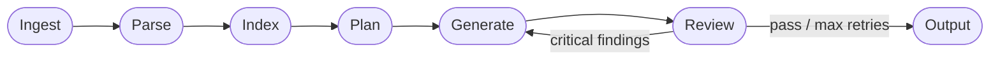

# Legacy-to-Modern Architect

[](#development)
[](https://nodejs.org)
[](https://www.typescriptlang.org)
[](https://langchain-ai.github.io/langgraphjs)
[](#)

An AI agent system that reverse-engineers legacy codebases and migrates them to **Clean Architecture** in **Nest.js + Angular**, powered by LangGraph and RAG.

Point it at any legacy repo — Java, PHP, TypeScript, Python, COBOL — and it produces a complete, reviewed, production-ready Nest.js project with a migration quality report.

---

## How It Works

The migration runs as a **6-stage LangGraph state machine**. Each stage is a graph node; a review-retry loop ensures the output meets Clean Architecture standards before writing files to disk.



| Stage | What it does |
|-------|-------------|
| **Ingest** | Clones the repo (local path or Git URL), detects languages, estimates API cost |
| **Parse** | Extracts classes, methods, business rules, and a dependency graph from each file |
| **Index** | Embeds all code chunks into PostgreSQL + pgvector for semantic search (RAG) |
| **Plan** | GPT-4.1 maps legacy bounded contexts to Nest.js modules and Angular features |
| **Generate** | Generates each module in dependency order, with a cumulative context manifest |
| **Review** | 4-pass validation (structural + pattern + business logic); auto-retries on failure |

---

## Real Migration Example

The [`output/`](./output) directory in this repo is a real migration of a legacy **IoT agricultural sensor platform** (Java + TypeScript, ~40 files). Duration: **4 min 39 sec**.

**Command used:**

```bash
npx ts-node src/main.ts migrate ./workspace/sensor-platform --output ./output
```

**Result — 37 files generated across 3 Nest.js modules:**

```
output/
├── src/
│   ├── sensor-management/
│   │   ├── domain/entities/sensor.entity.ts         # Domain aggregate + SensorType enum
│   │   ├── domain/ports/sensor.repository.ts        # Port interface (DIP)
│   │   ├── application/use-cases/                   # 5 use cases
│   │   ├── application/dto/                         # Request / response DTOs
│   │   ├── infrastructure/adapters/                 # Repository adapter
│   │   └── interface/controllers/sensors.controller.ts
│   ├── data-sample-operation/                       # 5 use cases, 4 adapters, 6 DTOs
│   └── shared/                                      # Auditable base entities + ports
└── MIGRATION_REPORT.md
```

**Sample — generated domain entity (zero manual edits):**

```typescript
// output/src/sensor-management/domain/entities/sensor.entity.ts
export enum SensorType {
  TEMPERATURE = 'TEMPERATURE',
  AIR_HUMIDITY = 'AIR_HUMIDITY',
  SOIL_HUMIDITY = 'SOIL_HUMIDITY',
  PRECIPITATION = 'PRECIPITATION',
  NITROGEN = 'NITROGEN',
  PHOSPHORUS = 'PHOSPHORUS',
  POTASSIUM = 'POTASSIUM',
  COMBINED = 'COMBINED',
}

export class Sensor extends AuditableAbstractAggregateRoot {
  constructor(
    public readonly id: string,
    public sensorCode: string,
    public type: SensorType,
    public status: SensorStatus = SensorStatus.ACTIVE,
    public lastSeen: Date = new Date(),
  ) {
    super(id);
  }

  updateLastSeen(): void {
    this.lastSeen = new Date();
    this.status = SensorStatus.ACTIVE;
  }

  markAsInactive(): void {
    this.status = SensorStatus.INACTIVE;
  }
}
```

**Migration report:**

```
Status:          success_with_warnings
Generated Files: 37
Modules:         3 Nest.js + 2 Angular
Duration:        279.5s

Warnings (1): ID generation inside use case — consider delegating to the repository
Info (5):     Use case delegation notes, NotFoundException mapping suggestions
```

See the full report at [`output/MIGRATION_REPORT.md`](./output/MIGRATION_REPORT.md).

---

## Tech Stack

| Layer | Technology |
|-------|------------|
| Runtime | Node.js 20+, TypeScript 5 |
| Framework | Nest.js 10 |
| Agent Orchestration | LangGraph.js |
| LLM (planning & generation) | OpenAI GPT-4.1 |
| LLM (file parsing) | OpenAI GPT-4.1-mini |
| Embeddings | OpenAI text-embedding-3-small |
| Vector Store | PostgreSQL + pgvector |
| TypeScript/JS AST | @typescript-eslint/typescript-estree |
| Java AST | java-parser |
| PHP AST | php-parser (glayzzle) |
| CLI | Commander.js |
| Architecture enforcement | eslint-plugin-boundaries |
| Testing | Jest + ts-jest |

---

## Prerequisites

- Node.js 20+
- Docker (for PostgreSQL + pgvector)
- OpenAI API key

---

## Quick Start

**1. Install dependencies**

```bash
npm install
```

**2. Configure environment**

```bash
cp .env.example .env
# Set OPENAI_API_KEY in .env
```

**3. Start the database and run a migration**

```bash
docker compose up -d

npx ts-node src/main.ts migrate ./path/to/legacy-repo --output ./output
```

---

## Usage

### CLI

```bash
npx ts-node src/main.ts migrate <source> [options]

  <source>             Local path or public Git URL
  --output <dir>       Output directory  (default: ./output)
  --retries <n>        Max review/retry cycles  (default: 3)
  --no-progress        Disable progress output
```

### REST API

Start the server:

```bash
npm run start:dev
```

Start a migration:

```bash
curl -X POST http://localhost:3000/api/migrations \
  -H "Content-Type: application/json" \
  -d '{ "repoSource": "https://github.com/user/legacy-repo" }'
```

Poll status:

```bash
curl http://localhost:3000/api/migrations/<migrationId>
```

Health check:

```bash
curl http://localhost:3000/health
```

---

## Output Structure

```
output/
├── src/
│   └── <module-name>/
│       ├── domain/
│       │   ├── entities/       # Aggregate roots, enums, value objects
│       │   └── ports/          # Repository interfaces (Dependency Inversion)
│       ├── application/
│       │   ├── use-cases/      # One use case per operation
│       │   └── dto/            # Request + response DTOs
│       ├── infrastructure/
│       │   └── adapters/       # Repository + external service adapters
│       └── interface/
│           └── controllers/    # Nest.js REST controllers
├── angular/                    # Angular feature modules
└── MIGRATION_REPORT.md         # Quality report with all findings
```

---

## Supported Source Languages

| Language | Parser | Extraction |
|----------|--------|------------|
| TypeScript / JavaScript | Native AST (`typescript-estree`) | Classes, methods, fields, imports, business rules |
| Java | Native CST (`java-parser`) | Classes, interfaces, methods, fields, annotations |
| PHP | Native AST (`php-parser`) | Classes, traits, interfaces, methods, `use` statements |
| Python | Generic LLM (`gpt-4.1-mini`) | Full structured extraction via prompt |
| COBOL | Generic LLM (`gpt-4.1-mini`) | Full structured extraction via prompt |
| C#, Ruby, Go, and others | Generic LLM fallback | Full structured extraction via prompt |

---

## Development

```bash
npm run build          # Compile TypeScript
npx tsc --noEmit       # Type check only
npm run lint           # ESLint with Clean Architecture boundary rules
npm test               # Unit tests
npm run test:cov       # Coverage report
npm run start:dev      # Watch mode (API)
```

### Test Coverage

| Suite | Tests | Status |
|-------|-------|--------|
| `ChunkingService` | 20 | Passing |
| `LanguageParserFactory` | 11 | Passing |
| **Total** | **31** | **All passing** |

---

## Architecture

See [ARCHITECTURE.md](./ARCHITECTURE.md) for the full system design: pipeline stages, RAG strategy (AST-aware chunking, tiered indexing, hybrid search), agent architecture, design patterns (Strategy, Factory, Port/Adapter, State Machine), and scalability decisions.

---

## Author

**Diego De La Flor** — AI Developer  
Portfolio project demonstrating LangGraph agent orchestration, RAG, Clean Architecture, and multi-language AST parsing.
